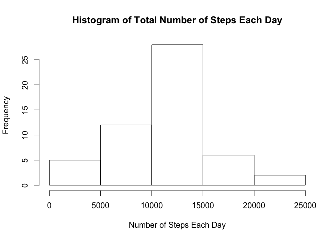
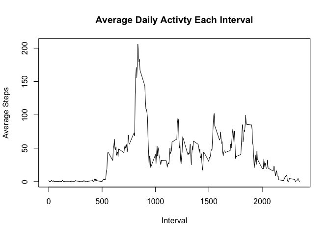
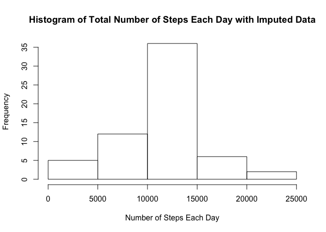
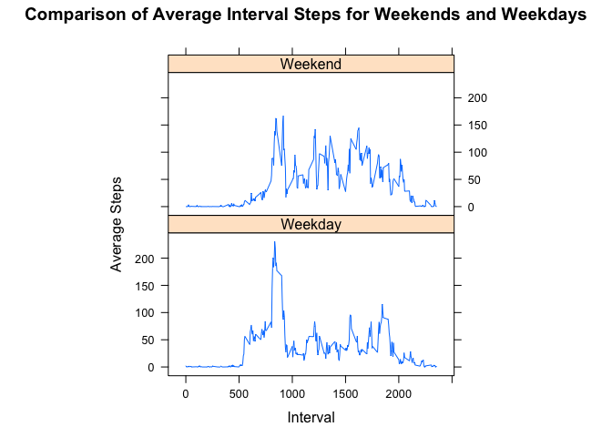

# Reproducible Research: Peer Assessment 1

## Install Packages Required For Analysis

```r
# Install dplyr if not already installed
if (!require("dplyr",character.only = TRUE))
{
  install.packages("dplyr",dep=TRUE)
  if(!require("dplyr",character.only = TRUE)) stop("dplyr package not found")
}
```

## Loading and preprocessing the data

```r
# Unzip activity.zip which is part of Git repository
unzip("activity.zip")

activityDataFrame <- read.csv("activity.csv")
```

## What is mean total number of steps taken per day?

The frequency of total number of steps taken per day is shown in the following histogram

```r
# Use dplyr pipeline to remove NA and then calculate total steps per date
stepsByDate <- activityDataFrame %>% na.omit() %>% group_by(date) %>% summarise(totalSteps = sum(steps))

hist(stepsByDate$totalSteps, 
     main="Histogram of Total Number of Steps Each Day", 
     xla ="Number of Steps Each Day")
```

 

```r
summarySteps <- stepsByDate %>% summarise(meanSteps = mean(totalSteps), medianSteps = median(totalSteps))

mean(summarySteps$meanSteps)
```

```
## [1] 10766.19
```

```r
median(summarySteps$medianSteps)
```

```
## [1] 10765
```

The mean total number of steps taken per day is 10,766.19 steps and the median total number of steps taken per day is 10,765.00 steps.

## What is the average daily activity pattern?

The following time series chart shows the average daily activity per interval:


```r
# Use dplyr pipeline to remove NA and then calculate average steps per date
avgStepsByInterval <- activityDataFrame %>% na.omit() %>% group_by(interval) %>% summarise(avgSteps = mean(steps))

plot(avgSteps~interval, data=avgStepsByInterval, type="l", 
     main="Average Daily Activty Each Interval", 
     xlab ="Interval", 
     ylab = "Average Steps")
```

 

* Which 5-minute interval, on average across all the days in the dataset, contains the maximum number of steps?


```r
avgStepsByInterval[which.max(avgStepsByInterval$avgSteps),]$interval
```

```
## [1] 835
```

The 835th interval.

## Imputing missing values

1. Calculate and report the total number of missing values in the dataset (i.e. the total number of rows with NAs)


```r
missingSteps <- activityDataFrame %>% filter(is.na(steps))

nrow(missingSteps)
```

```
## [1] 2304
```

The activity data set has 2304 rows with a NA for the number of steps.

2. Devise a strategy for filling in all of the missing values in the dataset. The strategy does not need to be sophisticated. 

A revised activity dataframe will be created by replacing the rows in the activity dataframe which contain NA steps with the mean steps of the interval

3. Create a new dataset that is equal to the original dataset but with the missing data filled in.


```r
# Use dplyr pipeline to replace rows with NA steps with mean steps of equivalent interval
revisedActivityDataFrame <- activityDataFrame %>% group_by(interval) %>% mutate(steps = ifelse(is.na(steps), mean(steps, na.rm = T), steps))

summary(revisedActivityDataFrame)
```

```
##      steps                date          interval     
##  Min.   :  0.00   2012-10-01:  288   Min.   :   0.0  
##  1st Qu.:  0.00   2012-10-02:  288   1st Qu.: 588.8  
##  Median :  0.00   2012-10-03:  288   Median :1177.5  
##  Mean   : 37.38   2012-10-04:  288   Mean   :1177.5  
##  3rd Qu.: 27.00   2012-10-05:  288   3rd Qu.:1766.2  
##  Max.   :806.00   2012-10-06:  288   Max.   :2355.0  
##                   (Other)   :15840
```

4. Make a histogram of the total number of steps taken each day and Calculate and report the mean and median total number of steps taken per day. Do these values differ from the estimates from the first part of the assignment? What is the impact of imputing missing data on the estimates of the total daily number of steps?


```r
# Use dplyr pipeline to calculate total steps per date
stepsByDate <- revisedActivityDataFrame  %>% group_by(date) %>% summarise(totalSteps = sum(steps))

hist(stepsByDate$totalSteps, 
     main="Histogram of Total Number of Steps Each Day with Imputed Data", 
     xla ="Number of Steps Each Day")
```

 

```r
revisedSummarySteps <- stepsByDate %>% summarise(meanSteps = mean(totalSteps), medianSteps = median(totalSteps))

mean(revisedSummarySteps$meanSteps)
```

```
## [1] 10766.19
```

```r
median(revisedSummarySteps$medianSteps)
```

```
## [1] 10766.19
```

| Statistics        | Original Data Set           | Revised Data Set  |
| ------------- |:-------------:| -----:|
| Mean      | 10,766.19 | 10,766.19 |
| Median     | 10,765.00      |   10,766.19|

The mean total number of steps taken per day is the **same** as the value before imputing missing data because missing values where replaced with the mean value for that particular 5-min interval which maintained the status quo. The median total number of steps taken per day is **minimally different** as we changed the frequency distribution due to the replacement of the NA's.

## Are there differences in activity patterns between weekdays and weekends?

* Create a new factor variable in the dataset with two levels – “weekday” and “weekend” indicating whether a given date is a weekday or weekend day.


```r
revisedActivityDataFrame$dayType = as.factor(ifelse(weekdays(as.POSIXlt(as.Date(revisedActivityDataFrame$date))) %in% c("Saturday","Sunday"), "Weekend", "Weekday")) 
```

* Make a panel plot containing a time series plot (i.e. type = "l") of the 5-minute interval (x-axis) and the average number of steps taken, averaged across all weekday days or weekend days (y-axis). 


```r
# Use dplyr pipeline to calculate average steps per dayType and Interval
stepsByDate <- revisedActivityDataFrame  %>% group_by(dayType, interval) %>% summarise(avgSteps = mean(steps))

library(lattice)
xyplot(avgSteps~interval|factor(dayType), data=stepsByDate, 
       aspect=1/2, 
       type="l", 
       main="Comparison of Average Interval Steps for Weekends and Weekdays",
       xlab="Interval",
       ylab="Average Steps")
```

 
